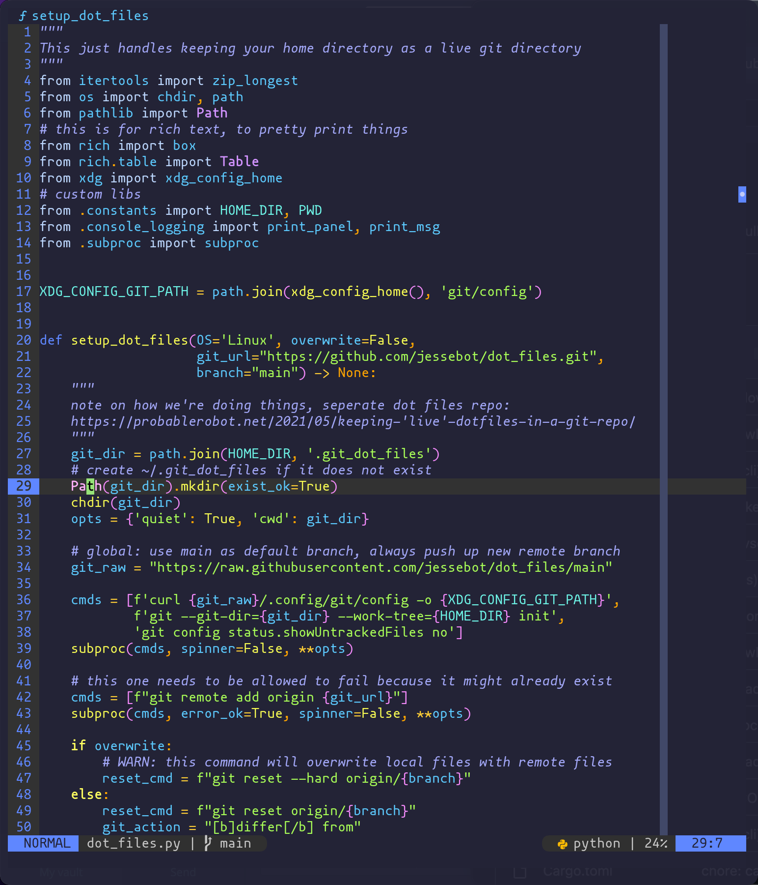

# 🛸 Space Chalk Theme for NeoVim 🎨
A theme trying to combine a love of neon space colors and pastel chalk board colors.



## Supported features

- [barbar] - tabline
- [barbecue] - referenceline
- [gitsigns] - git column
- [lualine] - status line for neovim
- [scrollbar.nvim] - scrollbar
- [telescope] - file browser, currently working on this
- [nvim-treesitter] - syntax highlighter, currently working on this


## Installation

You should be able to install this fine with any neovim plugin manager.

### packer

```lua
use {'space-chalk/spacechalk.nvim'}
```

### lazy

```lua
{
   'space-chalk/spacechalk.nvim',
    lazy = false, -- loaded during startup since it's the main colorscheme
    priority = 1000, -- load this before all other start plugins
    config = function()
        -- set the colorscheme here
        vim.cmd.colorscheme('spacechalk')
        vim.g.colors_name = 'spacechalk'
    end,
}
```
For more info on how to configure plugins via lazy, checkout [folke/lazy.nvim#-plugin-spec](https://github.com/folke/lazy.nvim#-plugin-spec).

## Setup
You can of course use vimscript instead of lua, but for those new to neovim, this is what you want to do:

```lua
-- you will want this after packer has been loaded
vim.cmd.colorscheme("spacechalk")
```

### tmux
If you are running neovim inside tmux:

```tmux
set-option -g default-terminal "xterm-256color"
set-option -ga terminal-overrides ',xterm-256color:Tc'
```

# Contributing and Troubleshooting

Note: this plugin is currently written in vimscript, but there are plans to convert to lua in the near future!

Contributions to get the syntax highlighting working everywhere are absolutely welcome. Feel free to open an issue if you need help as well :)

If you're new to vim colorschemes, here's some tips!

To see hex colors highlighted in neovim, I recommend installing [nvim-colorizer.lua].

## Get the current highlighting for a word/filetype
If you're already in a file in neovim, and the highlighting doesn't look quite right, 
but you're not sure what the variable is called, try some of these steps below:

### New in neovim `0.9.0` and up
You can now move your cursor over a word and then type `:Inspect` to get highlights for both your LSP and treesitter in one go :) You can check out `:h lsp-semantec-highlight` for more info.

If you find that a highlight from your LSP semantec highlights is incorrect, you can disable it with an autocommand. Here's an example of disabling the semantec highlighting for variables/parameters in a `Dockerfile`:

```lua
-- autocommand to disable lsp semantic highlighting for parameter/variable in 
-- Dockerfile because it competes with treesitter and is worse
vim.api.nvim_create_autocmd({"BufEnter", "BufWinEnter"}, {
  pattern = {"Dockerfile"},
  callback = function()
        vim.api.nvim_set_hl(0, '@lsp.type.parameter.dockerfile', {})
        vim.api.nvim_set_hl(0, '@lsp.type.variable.dockerfile', {})
    end,
})
```

### Prior to neovim `0.9.0`

This will show all highlights for the current file you have open:
```vim
:highlight
```

That will give the exact `highlight` commands for all the variables, but unfortunately it's not searchable, so you'll have to page through it ;(

If you know the variable you want to check though, you can do the following

```vim
" gets the current highlight for just the Function highlight group
:highlight Function
```

It may also be helpful to check out more about syntax/colors with:

```vim
:help syntax
```

#### nvim-treesitter
If you're using [nvim-treesitter] prior to neovim version `0.9.0`, I _highly_ recommend installing [nvim-treesitter/playground], as it can be really helpful for debugging a treesitter highlighting issue. Once installed, you can run the following to get the current highlight group under your cursor:

```vim
:TSHighlightCapturesUnderCursor
```

<!-- external links -->
[barbar]: https://github.com/romgrk/barbar.nvim "tabline"
[barbecue]: https://github.com/utilyre/barbecue.nvim "referenceline"
[gitsigns]: https://github.com/lewis6991/gitsigns.nvim "git column"
[lualine]: https://github.com/nvim-lualine/lualine.nvim "status line for neovim"
[scrollbar.nvim]: https://github.com/petertriho/nvim-scrollbar "scrollbar"
[telescope]: https://github.com/nvim-telescope/telescope.nvim "file list browser"
[nvim-colorizer.lua]: https://github.com/norcalli/nvim-colorizer.lua "colorizer for neovim"
[nvim-treesitter]: https://github.com/nvim-treesitter/nvim-treesitter "treesitter for nvim" 
[nvim-treesitter/playground]: https://github.com/nvim-treesitter/playground "debug tool for nvim-treesitter"
